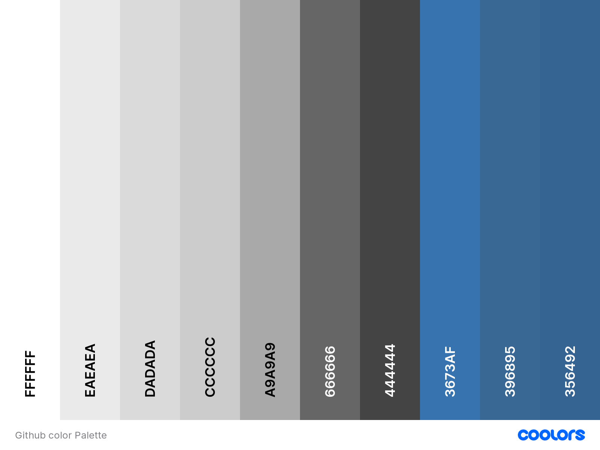

# Rosie Portfolio

The Rosie Porfolio Project was created as part of a series of lessons from the Code Institute. The lessons initially covered HTML and CSS, before returning and adding JavaScript with the Google Maps API. This has now been updated to use Leaflet.js for the mapping.

Visit the deployed site here: [Rosie Portfolio](https://kera-cudmore.github.io/rosie-portfolio/)

--- 

## User Experience

This site was created for Rosie, a fictional web developer. Rosie needs a portfolio site to be able to share her work experience, skills, CV and provide a contact form for people who would like to work with Rosie.

### User Stories

* As a user, I want to be able to find out more information about who Rosie is.
* As a user, I want to be able to see Rosie's work experience.
* As a user, I want to be able to view, and download Rosie's CV.
* As a user, I want to be able to contact Rosie directly from her portfolio.
* As a user, I want to be able to navigate to Rosie's social media.

- - -

## Design

### Colour Scheme

The colour palette for the site:

The colour palette for the GitHub Styles:

### Typography

Google Fonts was used to import the chosen fonts for use in the site, Exo and Roboto.

### Imagery

### Wireframes

Wireframes were created for mobile, tablet and desktop using ...

Wireframes links/images to go here

### Features

The website is comprised of 6 pages: The home page, resume page, contact page, interests page, github page and 404 page. 

* All Pages on the website have:

  - Top navigation bar. This enables users to easily navigate through the website regardless of the page they are on. The top navigation bar also allows users to download a copy of Rosie's CV.
    
    

  - Footer. The footer provides a small about bio, along with another link to download Rosie's CV and also Rosie's Social links.
    
    

  - Favicon. Each page's tab contains a favicon.

    

* Future Implementations.

### Accessibility

I have been mindful during coding to ensure that the website is as accessible friendly as possible. This has been have achieved by:

* Using semantic HTML.
* Using descriptive alt attributes on images on the site.
* Providing information for screen readers where there are icons used and no text.
* Ensuring that there is a sufficient colour contrast throughout the site.

- - -

## Technologies Used

### Languages Used

HTML, CSS, Javascript

### Frameworks, Libraries & Programs Used

[Balsamiq](https://balsamiq.com/) - Used to create wireframes.

[Git](https://git-scm.com/) - For version control.

[Github](https://github.com/) - To save and store the files for the website.

[Bootstrap Version 4.2.1](https://getbootstrap.com/docs/4.2/getting-started/introduction/) - CSS framework for building responsive, mobile-first sites.

[Google Fonts](https://fonts.google.com/) - To import the fonts used on the website.

[Font Awesome Version 4.7.0](https://fontawesome.com/) - For the iconography on the website.

[Google Dev Tools](https://developer.chrome.com/docs/devtools) - To troubleshoot and test features, solve issues with responsiveness and styling.

[Tiny PNG](https://tinypng.com/) To compress images.

[Birme](https://www.birme.net/) To resize images and convert to webp format.

[Favicon.io](https://favicon.io/) To create favicon.

[Am I Responsive?](http://ami.responsivedesign.is/) To show the website image on a range of devices.

[Shields.io](https://shields.io/) To add badges to the README

[Leaflet.js Version 1.9.4](https://leafletjs.com/examples/quick-start/) For the map on the interests page.

- - -

## Deployment & Local Development

### Deployment

The site is deployed using GitHub Pages: [Rosies Portfolio](https://kera-cudmore.github.io/rosie-portfolio/)

To Deploy the site using GitHub Pages:

1. Login (or signup) to Github.
2. Go to the repository for this project, kera-cudmore/TheQuizArms.
3. Click the settings button.
4. Select pages in the left hand navigation menu.
5. From the source dropdown select main branch and press save.
6. The site has now been deployed, please note that this process may take a few minutes before the site goes live.

### Local Development

#### How to Fork

To fork the repository:

1. Log in (or sign up) to Github.
2. Go to the repository for this project, [HTML and CSS Essentials Porfolio Project](https://github.com/kera-cudmore/rosie-portfolio).
3. Click the Fork button in the top right corner.

#### How to Clone

To clone the repository:

1. Log in (or sign up) to GitHub.
2. Go to the repository for this project, [HTML and CSS Essentials Porfolio Project](https://github.com/kera-cudmore/rosie-portfolio).
3. Click on the code button, select whether you would like to clone with HTTPS, SSH or GitHub CLI and copy the link shown.
4. Open the terminal in your code editor and change the current working directory to the location you want to use for the cloned directory.
5. Type 'git clone' into the terminal and then paste the link you copied in step 3. Press enter.

- - -

## Testing

Please see [testing.md](testing.md) for all testing performed
- - -

## Credits

### Code Used

This project was created as part of a series of lessons from the Code Institute. Small adjustments have been made by me upon completing the course to add some polish to this project.

### Content

Content for the site was provided by the Code Institute.

### Media

All Media for the site was provided by the Code Institute.
