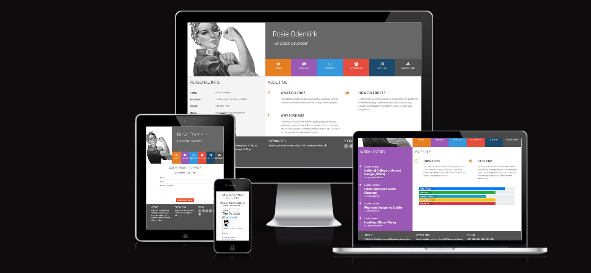
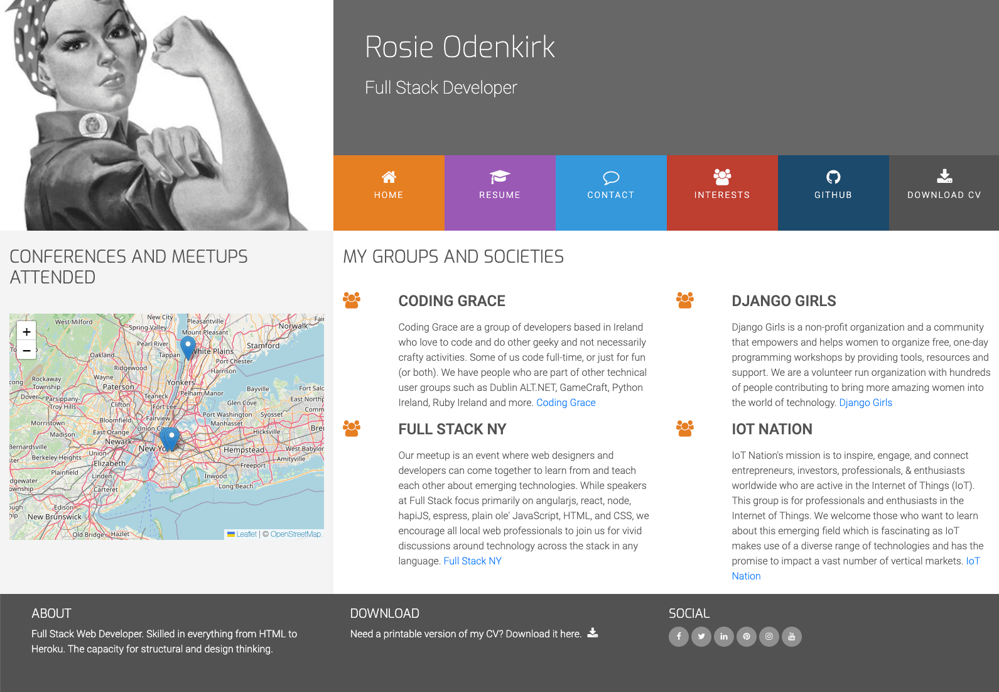
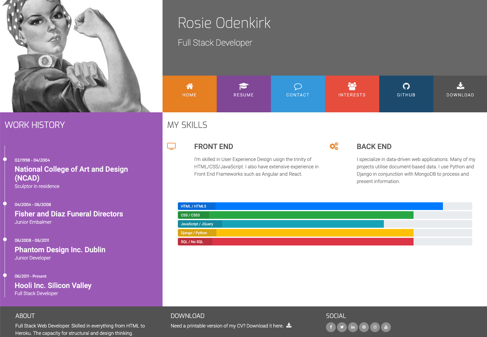
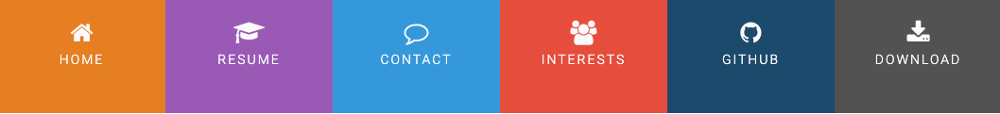
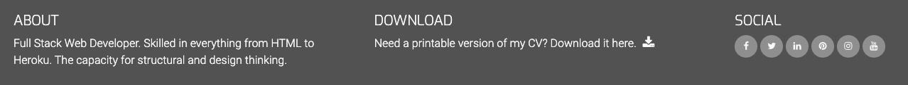
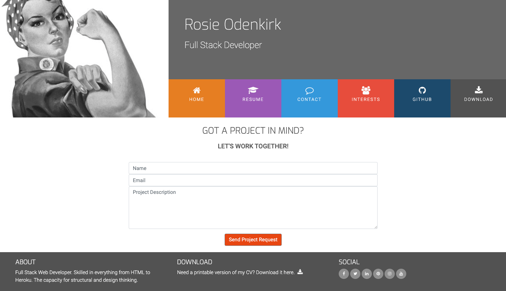

# Rosie Portfolio

Visit the deployed site here: [Rosie Portfolio](https://kera-cudmore.github.io/rosie-portfolio/)

---

## Automated Testing

### HTML & CSS Validation

The [W3C validator](https://validator.w3.org/) was used to validate all HTML and CSS on the site.

* [index.html](https://validator.w3.org/nu/?doc=https%3A%2F%2Fkera-cudmore.github.io%2Frosie-portfolio%2F) - Passed
* [interests.html](https://validator.w3.org/nu/?showsource=yes&doc=https%3A%2F%2Fkera-cudmore.github.io%2Frosie-portfolio%2Finterests.html) - Passed
* [resume.html](https://validator.w3.org/nu/?showsource=yes&doc=https%3A%2F%2Fkera-cudmore.github.io%2Frosie-portfolio%2Fresume.html) - Passed
* [github.html](https://validator.w3.org/nu/?doc=https%3A%2F%2Fkera-cudmore.github.io%2Frosie-portfolio%2Fgithub.html) - Passed
* [contact.html](https://validator.w3.org/nu/?showsource=yes&doc=https%3A%2F%2Fkera-cudmore.github.io%2Frosie-portfolio%2Fcontact.html) - Passed
* [404.html](https://validator.w3.org/nu/?showsource=yes&doc=https%3A%2F%2Fkera-cudmore.github.io%2Frosie-portfolio%2F404.html) - Passed

### JavaScript Validation

JS Hint was used to validate the JavaScript on the site.

* [github-information.js](documentation/testing/js-github-info-validation.png) - Passed 
* [maps.js](documentation/testing/js-map-validation.png) - warnings for undefined variable `L` and unused variable `marker`. I have left these as is for now as I have taken the code from the example directly from the Leaflet website.

* [sendemail.js](documentation/testing/js-send-email-validation.png) - Warnings for undefined variable `emailjs` and unused variable `sendMail`.

### Lighthouse Testing

#### Desktop

* [Home page](documentation/testing/lighthouse/desk-index.png)
* [Resume page](documentation/testing/lighthouse/desk-resume.png)
* [Contact page](documentation/testing/lighthouse/desk-contact.png)
* [Interests page](documentation/testing/lighthouse/desk-interests.png)
* [GitHub page](documentation/testing/lighthouse/desk-github.png)
* [404 page](documentation/testing/lighthouse/desk-404.png)

#### Mobile

* [Home page](documentation/testing/lighthouse/mobile-index.html)
* [Resume page](documentation/testing/lighthouse/mobile-resume.png)
* [Contact page](documentation/testing/lighthouse/mobile-contact.png)
* [Interests page](documentation/testing/lighthouse/mobile-interests.png)
* [GitHub page](documentation/testing/lighthouse/mobile-github.png)
* [404 page](documentation/testing/lighthouse/mobile-404.png)

---

## Manual Testing

### User Stories Testing

| Goal |  How are they Achieved? | Evidence |
| :--- | :--- | :--- |
| I want to be able to find out more information about who Rosie is. | Each page of the site contains a small bio about Rosie. Users are also able to view further information about Rosie on the home page in the about section, and on the interests page. |  |
| I want to be able to see Rosie's work experience. | Users can view Rosie's work history along with her skills on the resume page. Users are also able to download a copy of Rosie's CV which contains further information on her work history. |  |
| I want to be able to view, and download Rosie's CV. | Users are able to view and download Rosie's CV either by using the button in the top navigation or via the link in the footer. |   |
| I want to be able to contact Rosie directly from her portfolio. | Users can contact Rosie directly from her portfolio via the contact page. This contains a contact form that users can complete and submit to contact Rosie. Social links are also included in the footer as an alternative form of contact. |  |
| I want to be able to navigate to Rosie's social media. |Rosie's social media links are included on all pages in the footer. |  |

### Full Testing

| Feature | Expected Outcome | Testing Performed | Result | Pass or Fail |
| :--- | :--- | :--- | :--- | :--- |
| `NAV` |||||
| Image | When clicked user is directed to the home page | Click the image | Redirected to the home page | Pass |
| Home link | When clicked user is directed to the home page | Click the link | Redirected to the home page | Pass |
| Resume link | When clicked user is directed to the resume page | Click the link | Redirected to the resume page | Pass |
| Contact link | When clicked user is directed to the contact page | Click the link | Redirected to the contact page | Pass |
| Interests link | When clicked user is directed to the interests page | Click the link | Redirected to the interests page | Pass |
| GitHub link | When clicked user is directed to the GitHub page | Click the link | Redirected to the GitHub page | Pass|
| Download link | When clicked Rosies CV is opened to allow the user to download | Click the link | Redirected to the CV download | Pass |
||||||
| `FOOTER` |||||
| Download CV icon | When clicked Rosies CV is opened to allow the user to download | Click the icon | Redirected to the CV download | Pass |
| Social icons | When the user clicks on a social icon, they are redirected to the social page in a new tab | Click the icon | Redirected to the social page in a new tab| Pass |
||||||
| `CONTACT PAGE` |||||
| Contact form | Prevent submission of an empty form | If a user doesn't fill out the form and hits the send button, they should be prompted to fill out the form | Clicked send button with an empty form, a tooltip displated asking for an input in the first empty field, form didn't submit | Pass |
| | Input validation for fields, form doesn't submit | If a user inputs a value that doens't match the input type, they will be prompted to enter the correct information | Enter a word in the email field, on submission a tooltip prompted to enter a valid email address and the form wasn't submitted | Pass |
| | Form completed correctly | | | |
||||||
| `INTERESTS PAGE` |||||
| Map | User can interact with the map, zooming in and out | Used buttons to zoom in and out | Map zooms in and out | Pass |
| Links | Each link opens in a new tab | Click links | Link opens in new tab | Pass |
||||||
| `GITHUB PAGE` |||||
| Search input | When the user types a username, the users GitHub is displayed with a list of their repos | Search my GitHub username | My profile image and list of repos is displayed| Pass |
| Repo Links | When a repo link is clicked, the repo page is opened in a new tab | Click the link | Redirected to the repo page in a new tab | Pass |
